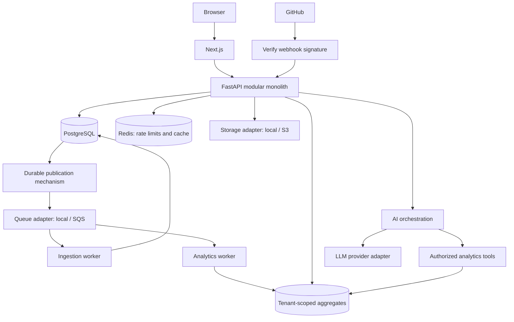

# System architecture

## Current foundation

The Next.js application contains an explicitly sample-data analytics preview plus real login/registration and account workspace flows. A same-origin proxy forwards allowlisted auth and organization operations to FastAPI. FastAPI uses PostgreSQL for accounts, revocable sessions, organizations, memberships, invitations and audit writes; Redis applies distributed auth attempt limits. Tenant routes enforce member/role authorization. GitHub ingestion, workers, live analytics, business caching and AI have not been implemented. Docker Compose binds local development services to loopback.

## Target architecture

Backend boundaries evolve into API (transport), schemas (contracts), services (business rules), repositories (database operations), integrations (GitHub), analytics (calculations), and AI (controlled orchestration). Avoid empty scaffolding. Workers run outside the API process and reuse domain logic.

PostgreSQL is authoritative; Redis is not authoritative for tenant permissions or event completion. API dependency readiness is a platform foundation, not meaningful production cache usage. Rate limiting starts with authentication; caching starts with measured read-heavy analytics.

## Future deployment

ALB → ECS/Fargate API and workers → RDS/PostgreSQL, ElastiCache/Redis, S3 and SQS. Terraform describes infrastructure; applying it is a separate budget-sensitive decision. Prometheus/Grafana and OpenTelemetry arrive with instrumentation; no always-on AWS footprint is assumed.

## UI design

Dark forest navigation, warm neutral canvas, bordered white information panels, emerald primary actions and subdued chart palettes. All demo values are labeled. Date/repository filters recalculate the daily sample series. Dialogs use native modal focus containment and Escape handling. Tables scroll horizontally on small screens; the shell uses a drawer navigation. Respect reduced motion. The account workspace screens use authenticated server state; the analytics preview remains disconnected sample data until GitHub ingestion and analytics are delivered.
