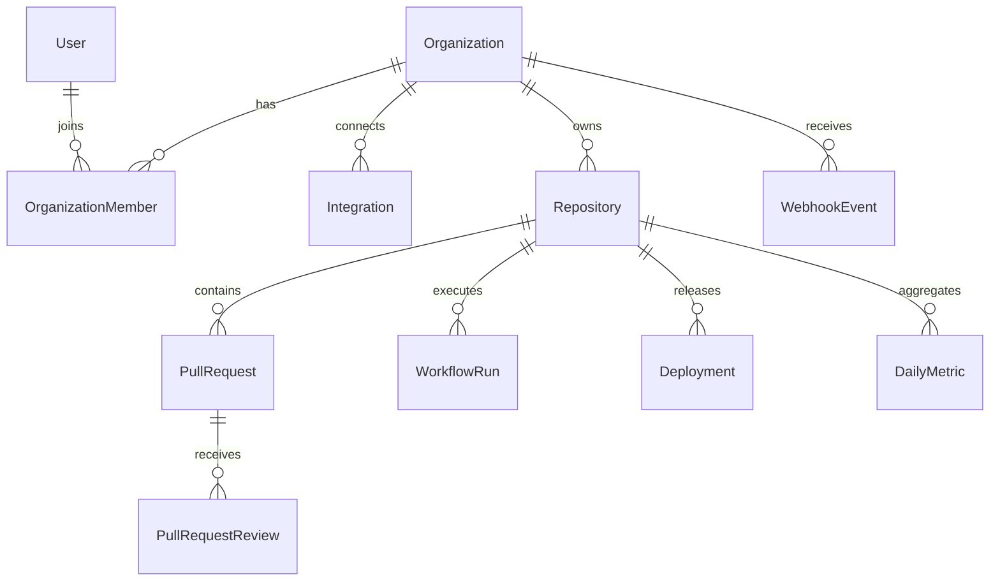

# Database plan

Migrations 0001–0003 create users, sessions, audit logs, organizations, memberships, invitations, and tenant-linked audit records.

`organization_members` is unique on `(organization_id, user_id)` and role-constrained. `organization_invitations` is unique on `(organization_id, email)` and token hash, with an explicit non-owner role constraint and expiry. Invitation tokens are single-use bearer secrets represented at rest only by SHA-256 digests. The raw token is returned once to the administrator for delivery; email delivery and verified identity are not implemented. `audit_logs.organization_id` is nullable so pre-tenant account events remain valid and tenant actions can be scoped.

Subsequent GitHub entities use external IDs and tenant-scoped ownership. Audit security-sensitive mutations in the same transaction where feasible.

## GitHub catalog migration 0004

`integrations` stores organization, GitHub host/app/installation/account IDs, display login, status and authorization generation. A partial unique index reserves an installation for one organization while active or suspended; disconnect releases the binding without transferring historical repository records. Organization listing has an index. No provider secrets are stored.

`repositories` stores the external ID, full name, privacy/archive flags, independent selection/accessibility flags and catalog refresh timestamp. `(organization_id, provider_host, external_id)` is unique. The composite foreign key to `(organization_id, integration_id, provider_host)` prevents cross-tenant integration references at the database level. Catalog reads by tenant/integration have a matching index. Renames preserve identity; selection defaults to false. GitHub.com is the only supported provider host in this slice.

This is the schema/client slice, not a connection API. Callback authorization, generation updates on disconnect, catalog reconciliation and audit writes will be implemented together in the next service/API slice. No completed engineering sync is represented by these catalog fields. Application authorization must still precede every future read/write; database constraints alone do not authorize users.

GitHub authors/reviewers may not be platform users; choose an external identity representation during GitHub modeling rather than attaching arbitrary GitHub IDs to User foreign keys. Raw events require durable delivery uniqueness. Every tenant-owned relationship must preserve the tenant boundary, including child entities reached through repositories.

Daily metric aggregates need enough counts/sums to recompute weighted window values: do not average averages. Define UTC boundaries, success denominators, excluded workflows and missing timestamps before implementing analytics. Index based on concrete query patterns (tenant/repository/time, delivery/external IDs, foreign keys), with documented rationale.

## Conceptual ERD — future, not a migration

